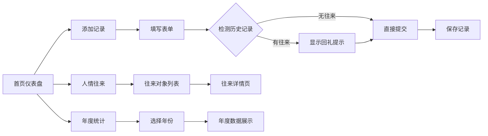

## 1. 产品概述

人情往来礼金账本是一款帮助用户管理红白喜事随礼记录的工具应用。用户可以记录每次随礼的详情，系统自动按家庭/个人维度整理收支对比，智能提示回礼金额，并支持按年份查看人情支出总览。

- **核心价值**：解决中国人情社会中"礼金往来记不清、回礼数额拿捏不准"的痛点
- **目标用户**：需要管理人情往来的普通家庭用户
- **产品定位**：简洁实用、具有传统美学的个人账本工具

## 2. 核心功能

### 2.1 用户角色
| 角色 | 注册方式 | 核心权限 |
|------|----------|----------|
| 普通用户 | 无需注册，本地存储 | 记录、查看、管理所有人情往来数据 |

### 2.2 功能模块
1. **首页仪表盘**：年度收支概览、最近记录、快捷操作入口
2. **记录管理**：添加/编辑/删除随礼记录，包含对方姓名、事由、金额、日期等
3. **人情往来**：按家庭/个人维度展示收支对比，"我随出去的"与"对方回礼的"对比
4. **智能回礼提示**：新增记录时，自动提示上次对方随礼金额及建议回礼金额
5. **年度统计**：按年份查看人情支出总览、分类统计

### 2.3 页面详情
| 页面名称 | 模块名称 | 功能描述 |
|---------|----------|----------|
| 首页仪表盘 | 数据概览卡片 | 展示本年支出、本年收入、结余、记录总数等关键指标 |
| 首页仪表盘 | 最近记录列表 | 展示最近5条随礼记录，支持快速查看详情 |
| 首页仪表盘 | 快捷操作 | 快速添加记录、快速跳转到人情往来页面 |
| 记录管理 | 添加记录表单 | 表单包含：对方姓名/家庭、事由（红事/白事/其他）、金额、日期、备注 |
| 记录管理 | 记录列表 | 所有记录的列表展示，支持搜索、筛选、编辑、删除 |
| 人情往来 | 往来对象列表 | 按家庭/个人维度展示所有往来对象，显示收支对比 |
| 人情往来 | 往来详情 | 展示与某个人/家庭的所有往来记录及收支对比 |
| 年度统计 | 年度总览 | 按年份展示支出、收入、结余情况 |
| 年度统计 | 分类统计 | 按事由类型统计支出分布 |
| 智能提示 | 回礼提示 | 添加记录时，若对方曾随过礼，自动提示上次金额及建议 |

## 3. 核心流程

### 3.1 添加随礼记录流程
用户打开应用 → 点击"添加记录" → 填写对方姓名/家庭、事由、金额、日期 → 系统检测对方历史记录 → 显示回礼提示（如有）→ 确认提交 → 记录保存成功

### 3.2 查看人情往来流程
用户进入"人情往来"页面 → 查看所有往来对象列表 → 点击某个对象 → 查看详细往来记录及收支对比

### 3.3 查看年度统计流程
用户进入"年度统计"页面 → 选择年份 → 查看该年度支出、收入、结余及分类统计

## 4. 用户界面设计

### 4.1 设计风格
- **主色调**：中国红（#C41E3A）作为主色，象征喜庆与传统
- **辅助色**：金色（#D4AF37）作为点缀，代表礼金的珍贵感
- **背景色**：暖米色（#FDF5E6）营造温馨传统的氛围
- **文字色**：深墨色（#2C2C2C）确保阅读舒适度
- **按钮风格**：圆角矩形，微阴影，悬停有轻微放大效果
- **字体**：标题使用「Noto Serif SC」（思源宋体），正文使用「Noto Sans SC」（思源黑体）
- **布局风格**：卡片式布局，适度留白，传统纹样装饰
- **图标风格**：线性图标搭配传统元素（如红包、灯笼、祥云等）

### 4.2 页面设计概览
| 页面名称 | 模块名称 | UI元素 |
|---------|----------|--------|
| 首页仪表盘 | 顶部导航 | Logo、应用名称、页面切换标签 |
| 首页仪表盘 | 数据卡片 | 四张统计卡片，红色渐变背景，金色数字 |
| 首页仪表盘 | 最近记录 | 时间线式布局，红/蓝标签区分支出/收入 |
| 首页仪表盘 | 快捷按钮 | 浮动添加按钮，红包样式 |
| 记录管理 | 表单页 | 传统纸张质感背景，标签式输入 |
| 人情往来 | 列表页 | 头像+姓名，收支对比条形图 |
| 人情往来 | 详情页 | 收支对比大卡片，时间线记录列表 |
| 年度统计 | 统计页 | 年份选择器，数据卡片，饼图/柱状图 |
| 智能提示 | 提示框 | 金色边框，红包图标，醒目的建议金额 |

### 4.3 响应式设计
- **设计原则**：桌面端优先，移动端适配
- **断点设置**：768px（平板）、480px（手机）
- **移动端优化**：
  - 底部Tab导航替代顶部导航
  - 卡片单列布局
  - 触摸友好的按钮尺寸（最小44px）
  - 表单输入优化（数字键盘等）

### 4.4 动效设计
- 页面切换：平滑淡入淡出
- 数据加载：数字滚动动画
- 卡片悬停：轻微上浮+阴影加深
- 添加成功：红包弹跳动效
- 回礼提示：渐入+轻微缩放动效
