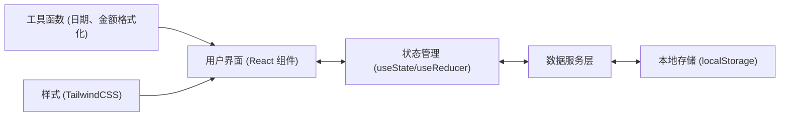
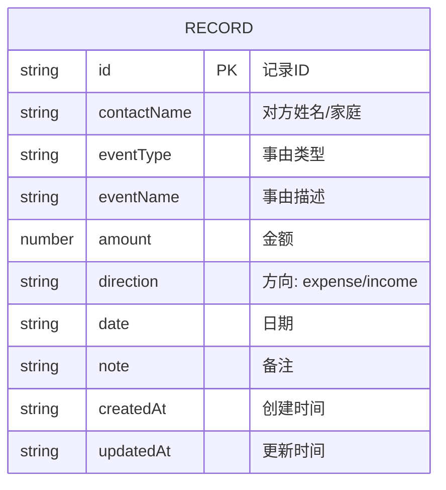

## 1. 架构设计

本应用为纯前端单页应用，数据存储在浏览器本地 localStorage 中，无需后端服务。



## 2. 技术选型说明

- **前端框架**：React@18 + TypeScript
- **构建工具**：Vite@5
- **样式方案**：TailwindCSS@3
- **路由管理**：React Router DOM@6
- **图标库**：Lucide React
- **数据存储**：localStorage（浏览器本地存储）
- **图表库**：Recharts（用于数据可视化）
- **状态管理**：React Hooks（useState + useContext）

### 技术选型理由
- **React + TypeScript**：组件化开发，类型安全，易于维护
- **Vite**：开发体验好，构建速度快
- **TailwindCSS**：快速构建UI，响应式设计方便
- **localStorage**：纯前端应用，数据保存在本地，保护用户隐私
- **Recharts**：React生态中成熟的图表库，易于集成

## 3. 路由定义

| 路由路径 | 页面名称 | 功能描述 |
|---------|----------|----------|
| `/` | 首页仪表盘 | 展示数据概览、最近记录、快捷操作 |
| `/records` | 记录列表 | 所有随礼记录列表，支持搜索筛选 |
| `/records/add` | 添加记录 | 添加新的随礼记录 |
| `/records/:id/edit` | 编辑记录 | 编辑已有的随礼记录 |
| `/contacts` | 人情往来 | 按家庭/个人维度展示往来列表 |
| `/contacts/:id` | 往来详情 | 展示与某人/家庭的详细往来记录 |
| `/statistics` | 年度统计 | 按年份查看支出总览及分类统计 |

## 4. 数据模型

### 4.1 数据实体关系



### 4.2 数据结构定义

```typescript
// 事由类型
type EventType = 'wedding' | 'funeral' | 'birthday' | 'baby' | 'housewarming' | 'promotion' | 'other';

// 收支方向
type Direction = 'expense' | 'income';

// 随礼记录
interface GiftRecord {
  id: string;
  contactName: string;      // 对方姓名或家庭名称
  eventType: EventType;     // 事由类型
  eventName: string;        // 事由名称（如"张三婚礼"）
  amount: number;           // 金额
  direction: Direction;     // 支出/收入
  date: string;             // 日期 YYYY-MM-DD
  note: string;             // 备注
  createdAt: string;        // 创建时间
  updatedAt: string;        // 更新时间
}

// 往来对象统计
interface ContactSummary {
  name: string;             // 姓名/家庭名称
  totalExpense: number;     // 我随出的总金额
  totalIncome: number;      // 对方回礼总金额
  balance: number;          // 收支差额（正=我随出多，负=对方随出多）
  recordCount: number;      // 往来次数
  lastRecordDate: string;   // 最近一次往来日期
  lastIncomeAmount: number; // 对方最近一次随礼金额（用于回礼提示）
  lastIncomeDate: string;   // 对方最近一次随礼日期
}

// 年度统计
interface YearlyStats {
  year: number;
  totalExpense: number;     // 年度总支出
  totalIncome: number;      // 年度总收入
  balance: number;          // 年度结余
  recordCount: number;      // 年度记录数
  expenseByType: Record<EventType, number>;  // 按类型统计支出
  incomeByType: Record<EventType, number>;   // 按类型统计收入
  monthlyExpense: number[]; // 月度支出（12个月）
  monthlyIncome: number[];  // 月度收入（12个月）
}
```

### 4.3 localStorage 存储结构

```typescript
// 存储键名
const STORAGE_KEY = 'gift_ledger_records';

// 存储格式
interface StorageData {
  records: GiftRecord[];
  version: string;  // 数据版本号，用于后续迁移
}
```

## 5. 核心模块说明

### 5.1 数据服务层 (services/storage.ts)
- `getRecords()`: 获取所有记录
- `addRecord(record: Omit<GiftRecord, 'id' | 'createdAt' | 'updatedAt'>)`: 添加记录
- `updateRecord(id: string, record: Partial<GiftRecord>)`: 更新记录
- `deleteRecord(id: string)`: 删除记录
- `getRecordById(id: string)`: 根据ID获取记录

### 5.2 业务逻辑层 (services/statistics.ts)
- `getContactSummaryList()`: 获取所有往来对象的统计列表
- `getContactDetail(name: string)`: 获取某个往来对象的详细信息
- `getYearlyStats(year: number)`: 获取指定年份的统计数据
- `getAvailableYears()`: 获取有数据的年份列表
- `getGiftSuggestion(contactName: string)`: 获取回礼建议

### 5.3 工具函数 (utils/)
- `date.ts`: 日期格式化、比较
- `money.ts`: 金额格式化（人民币样式）
- `storage.ts`: localStorage 封装
- `id.ts`: 生成唯一ID
